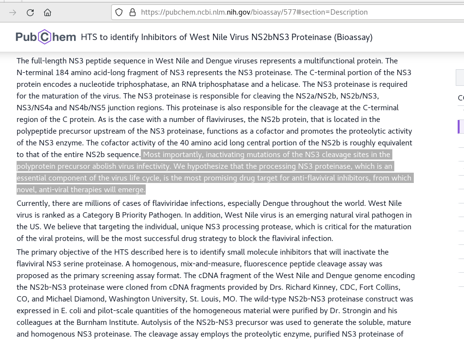
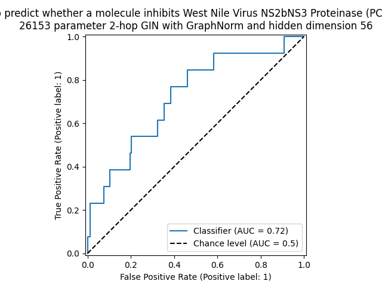
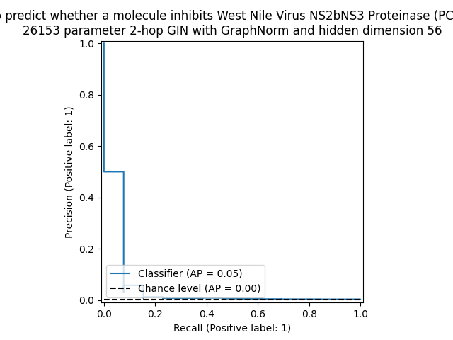
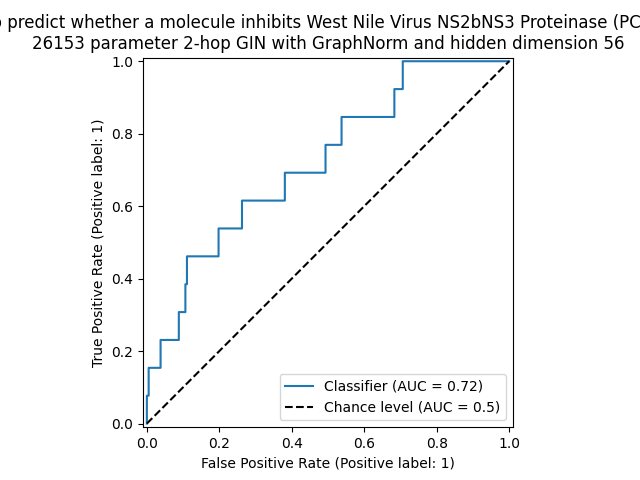

# tiny-GIN-for-WNV

**WORK IN PROGRESS REPO, NOT FOR ANY COMPETITION**

Trying to apply a similar network to https://github.com/willy-b/tiny-GIN-for-ogbg-molhiv/ to a West Nile Virus related dataset.

It is fun to participate in the Open Graph Benchmark ogbg-molhiv competition to build a predictor for identifying molecules with antiviral activity for HIV ( https://web.archive.org/web/20240822032633/https://ogb.stanford.edu/docs/leader_graphprop/#ogbg-molhiv ) for which https://github.com/willy-b/tiny-GIN-for-ogbg-molhiv/ got 22nd place, but many antivirals for HIV are already available.

It is interesting to apply similar techniques to widespread viruses for which there are not yet any approved antiviral drugs available.
West Nile Virus (WNV) would be an example of such a virus.

OGB has no dataset available at this time for West Nile Virus, but PubChem BioAssay from NCBI has many.

I will start by considering the West Nile Virus related dataset "HTS to identify Inhibitors of West Nile Virus NS2bNS3 Proteinase" and predicting such NS2bNS3 protease inhibitors as they were considered likely at the time of that datasets publication to be WNV antiviral drug candidates:


The dataset is from 2006, but see also the 2021 paper "Targeting the protease of West Nile virus" ( Voss and Nitsche 2021 , https://pmc.ncbi.nlm.nih.gov/articles/PMC8372202/ ) 
for a review of why the NS2bNS3 proteinase is still a promising target for WNV antivirals.

We can put that into OGB format for consistency and test a similar tiny Graph Isomorphism Network (GIN) on it. More datasets are coming as AID 577 only has 119 active molecules - see https://github.com/willy-b/tiny-GIN-for-WNV/pull/14 for incoming support of AID 588689 ( https://pubchem.ncbi.nlm.nih.gov/bioassay/588689 ) which has over 1000 active molecules (that inhibit the flavivirus genome capping enzyme).

NOTE THERE ARE NO COMPETITIONS ASSOCIATED WITH THESE DATASETS THAT I AM AWARE OF, THIS IS JUST FOR INTEREST IN THE PROBLEM UNLIKE THE OGBG-MOLHIV REPO.

# Trying it out

(work in progress, no official statistics available yet, splits are randomized per run, and reporting on test split is disabled by hand for now)

1. Install dependencies (run `install_dependencies.sh` this comes with or commands below):

```
pip install torch-scatter -f https://pytorch-geometric.com/whl/torch-2.2.1+cu121.html
pip install torch-sparse -f https://pytorch-geometric.com/whl/torch-2.2.1+cu121.html
pip install torch-geometric # I'm using 2.5.3 right now
pip install ogb # I'm using 1.3.6 right now
```

2. Run this script `python main_gin.py` (I'm using python 3.10.12 but should be flexible)

# Example recent output/performance

(no official statistics yet as doing hyperparameter search, example below is not the best and not the worst I have seen)
(can use `--random_seed` argument and run on `--device cpu` for reproducible runs)

## One run




## Another run





Notes:

- The above does not use the more challenging molecular structure scaffold split used by MoleculeNet for their benchmarks (like in the ogbg-molhiv challenge) which ensure that the model is not just matching extremely similar molecules that got divided into the train vs valid or test split and instead ensures generalization is occurring. Support for a scaffold split via MoleculeNet's contribution to the DeepChem library is coming in https://github.com/willy-b/tiny-GIN-for-WNV/pull/14 .

- When evaluating the average precision, note that the base rate is <0.2% so e.g. average precision of 9% is pretty good and getting a hit with a very high score immediately as the first result is unlikely to happen by chance.

- The weight decay was technically `512e-6` for those examples instead of default `5e-4` because I was using powers of 2 multiplied by 1e-6 but should be an insignificant difference and rest of parameters were current defaults. running the defaults several times should produce similar results.

**Note, I will use the default split and report on random splits when I eventually evaluate this though I support in the code a fixed train/valid/test split, due to different hardwares giving different random numbers for some generators causing me to be paranoid about myself or others seeing summary statistics from different random splits (unlike for the OGB competition in other repo (ogbg-molhiv) where the splits are preset by the authority).**

**The current code will already use random splits between train and non-test holdout when the `--hold_out_addl_data_from_train_set_as_dev_for_addl_generalization_check` argument is used, but the test split should stay constant, and I have not yet observed that varying on different hardware (Google dedicated VM (no GPU) vs. other Colab VM types, etc) which see differences in other random numbers, like those used for weight initialization. I checked and in my experiments I am NOT getting any variation in that split / contamination from test but after I report on the default test split, I will also report a freshly trained set of models on new random splits as well just to be careful.**

**One can also expect still statistically significant but worse than when validation set is used for early stopping/model selection performance on one's holdout set. Above I have not reported a holdout value as I was still doing a hyperparameter search.**

# References

### PubChem BioAssay: HTS to identify Inhibitors of West Nile Virus NS2bNS3 Proteinase

PubChem Identifier: AID 577
URL: https://pubchem.ncbi.nlm.nih.gov/bioassay/577

### PyTorch Geometric

- Fey, Matthias and Lenssen, Jan E. Fast Graph Representation Learning with PyTorch Geometric. ICLR Workshop on Representation Learning on Graphs and Manifolds, 2019. (Graph Isomorphism Network (GIN) implementation used)

### GraphNorm

- Tianle Cai and Shengjie Luo and Keyulu Xu and Di He and Tie-Yan Liu and Liwei Wang. GraphNorm: A Principled Approach to Accelerating Graph Neural Network Training. Proceedings of the 38th International Conference on Machine Learning, 2021.

### Graph Isomorphism Network (GIN)

- Xu, Keyulu and Hu, Weihua and Leskovec, Jure and Jegelka, Stefanie. How Powerful Are Graph Neural Networks? International Conference on Learning Representations, 2019. https://openreview.net/forum?id=ryGs6iA5Km , https://arxiv.org/pdf/1810.00826 . (Graph Isomorphism Network (GIN) original paper)

### Open Graph Benchmark (OGB)

(note only the OGB data format and evaluator are used here, this is NOT an ogb dataset and not to be confused with their ogbg-molpcba which is 128 selected pubchem bioassays NOT including AID 577 we consider here)

- Hu, Weihua and Fey, Matthias and Zitnik, Marinka and Dong, Yuxiao and Ren, Hongyu and Liu, Bowen and Catasta, Michele and Leskovec, Jure. Open Graph Benchmark: Datasets for Machine Learning on Graphs. arXiv preprint arXiv:2005.00687, 2020.

## Acknowledgements

Credit to Stanford XCS224W (certificate of completion with link to course and program info can be found at https://digitalcredential.stanford.edu/check/27C7D07B3EF8511E8B9BBA720E9A7C51BE3CBC49F80B7F32D1839B5D24442250U3BuVnNsVW9ldVdCQURiRXFZSXo2d3ZlOW5BSDJWVzUrVit1VGFQRHN2UVhVYjQ3 ) for getting me started with Graph Neural Networks.

Credit to "Massively Multitask Networks for Drug Discovery" (Ramsundar et al 2015, https://arxiv.org/abs/1502.02072 ) and "Discovery of a structural class of antibiotics with explainable deep learning" (Wong et al 2023, https://www.nature.com/articles/s41586-023-06887-8 ) for inspiring me to pursue this challenge and to the authors of Wong et al 2023 in particular for making the world a better place by discovering new antibiotics for MRSA using deep learning.

Credit to "Keeping Neural Networks Simple by Minimizing the Description Length of the Weights" ( Hinton et al 1993, https://www.cs.toronto.edu/~fritz/absps/colt93.pdf ), and "Representation Learning on Graphs with Jumping Knowledge Networks" ( Xu et al 2018, https://arxiv.org/abs/1806.03536 ) for giving me ideas that helped me reduce the parameter count.
