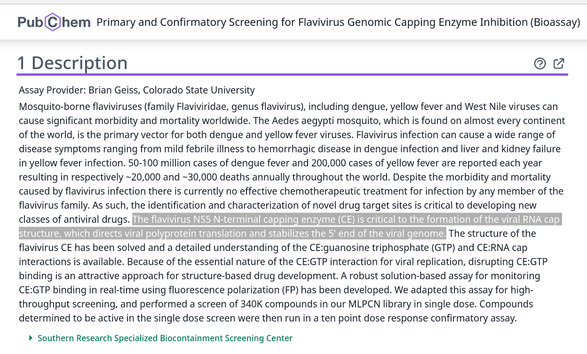
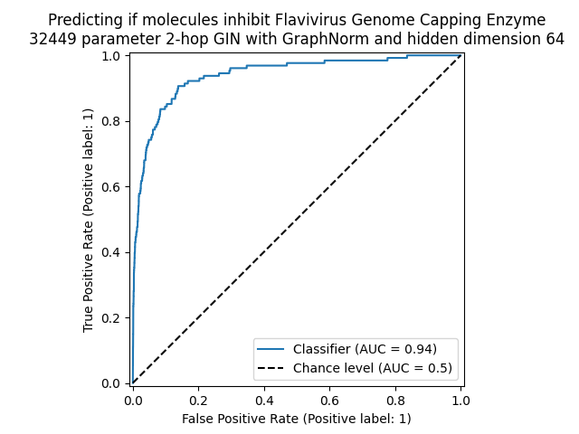
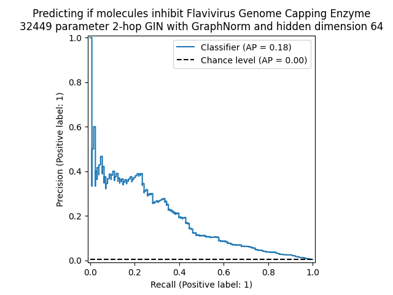

# tiny-GIN-for-WNV

**WORK IN PROGRESS REPO, NOT FOR ANY COMPETITION**

### Description 

Trying to apply a similar network to https://github.com/willy-b/tiny-GIN-for-ogbg-molhiv/ to West Nile Virus related datasets.

The author was honored to have the opportunity to participate in the Open Graph Benchmark ogbg-molhiv competition to build a classifier for attempting to identify molecules with antiviral activity for HIV ( https://web.archive.org/web/20240822032633/https://ogb.stanford.edu/docs/leader_graphprop/#ogbg-molhiv ) for which https://github.com/willy-b/tiny-GIN-for-ogbg-molhiv/ got 22nd place. However, many antivirals for HIV are already available.

It is perhaps more interesting to apply similar techniques to widespread viruses for which there are not yet any approved antiviral drugs available.
West Nile Virus (WNV) or flaviviruses generally would be examples of such viruses.

OGB has no dataset available at this time for West Nile Virus, but PubChem BioAssay from NCBI has some data.

I will start by supporting two West Nile Virus related datasets, by putting them into OGB format for consistency:

#### (1) AID 588689: "Primary and Confirmatory Screening for Flavivirus Genomic Capping Enzyme Inhibition" (**BETTER DATASET SIZE, BUT LESS SPECIFIC**)

https://pubchem.ncbi.nlm.nih.gov/bioassay/588689



#### (2) PCBA AID 577: "HTS to identify Inhibitors of West Nile Virus NS2bNS3 Proteinase" (**SMALL DATASET SIZE**)

as such NS2bNS3 protease inhibitors as they were considered likely at the time of that datasets publication to be WNV antiviral drug candidates

https://pubchem.ncbi.nlm.nih.gov/bioassay/577


The dataset is from 2006, but see also the 2021 paper "Targeting the protease of West Nile virus" ( Voss and Nitsche 2021 , https://pmc.ncbi.nlm.nih.gov/articles/PMC8372202/ ) 
for a review of why the NS2bNS3 proteinase is still a promising target for WNV antivirals.

We can put these datasets into OGB format and use a Murcko scaffold split (same as MoleculeNet team did for molhiv dataset used by OGB team for ogbg-molhiv) to ensure the model is learning to generalize its predictions to non-similar molecules (not just matching similar molecules in the training set).

### Scaffold splitting details

We are using a scaffold split since https://github.com/willy-b/tiny-GIN-for-WNV/pull/14 (Note AID 577 may not have sufficient data to analyze under scaffold split, since it only has 119 active molecules total), prior to that was using a random split for AID 577 and AID 588689 had not yet been added.

For Murcko scaffold splitting, we use https://deepchem.readthedocs.io/en/2.8.0/api_reference/splitters.html#scaffoldsplitter per "MoleculeNet: a benchmark for molecular machine learning" ( https://pubs.rsc.org/en/content/articlehtml/2018/sc/c7sc02664a ) section 3.2 Data Splitting: "Scaffold splitting splits the samples based on their two-dimensional structural frameworks [...] MoleculeNet contributes the code for these splitting methods into DeepChem. "

See also regarding MoleculeNet's use of scaffold split for their HIV antiviral dataset, section 3.1.9
"As we are more interested in discover new categories of HIV inhibitors, scaffold splitting (introduced in the next subsection) is recommended for this dataset."**

(Scaffold split data is MORE DIFFICULT than randomly split data.)

Note that once the molecules in the dataset are mapped to their scaffolds, which scaffolds go into which split can still be randomized, and we support a splitting seed for that.

NOTE THERE ARE NO COMPETITIONS ASSOCIATED WITH THESE DATASETS THAT I AM AWARE OF, THIS IS JUST FOR INTEREST IN THE PROBLEM UNLIKE THE OGBG-MOLHIV REPO, though I am going to try to writeup https://pubchem.ncbi.nlm.nih.gov/bioassay/588689 and contribute it back to OGB team after evaluating their baseline models on it.


# Trying it out

(work in progress, no official statistics available yet, splits are randomized per run, and reporting on test split is disabled by hand for now)

1. Install dependencies (run `install_dependencies.sh` this comes with or commands below):

```
pip install torch-scatter -f https://pytorch-geometric.com/whl/torch-2.2.1+cu121.html
pip install torch-sparse -f https://pytorch-geometric.com/whl/torch-2.2.1+cu121.html
pip install torch-geometric # I'm using 2.5.3 right now
pip install ogb # I'm using 1.3.6 right now
```

2. Run this script `python main_gin.py --use_scaffold_split` (I'm using python 3.10.12 but should be flexible)

Default hyperparameters are chosen to result in an extremely tiny model (for a quick check) that does ok for both datasets, but for AID 588689 one can do better with:

```
python main_gin.py --aid_id 588689 --random_seed 0 --use_scaffold_split --epochs 50 --hidden_dim 64 --weight_decay 1e-6 --batch_size 128
```

# Example recent output/performance (validation split, not test)

32,449 parameter model, using 9 atom features only
2-layer 64-hidden dimension GIN with post-graph embed MLP, batch size 128, 1e-6 weight decay, and GraphNorm

(same exact hyperparameter configuration as I used in 2024 July for ogbg-molhiv competition except batch size increased from 32 to 128 and added GraphNorm instead of BatchNorm)

For performance across 10 seeds, see https://colab.research.google.com/drive/17JILSAkHj4IvKIpksBpjD0yrSyIVGZTv 

```
# but you can also reproduce the results with e.g.
python main_gin.py --aid_id 588689 --random_seed 0 --use_scaffold_split --epochs 50 --hidden_dim 64 --weight_decay 1e-6 --batch_size 128
```

Seed 1 I include ROC and PRC curves here but see notebook for details:





# References

### PubChem BioAssay: Primary and Confirmatory Screening for Flavivirus Genomic Capping Enzyme Inhibition

PubChem Identifier: AID 588689
URL: https://pubchem.ncbi.nlm.nih.gov/bioassay/588689

### PubChem BioAssay: HTS to identify Inhibitors of West Nile Virus NS2bNS3 Proteinase

PubChem Identifier: AID 577
URL: https://pubchem.ncbi.nlm.nih.gov/bioassay/577

### PyTorch Geometric

- Fey, Matthias and Lenssen, Jan E. Fast Graph Representation Learning with PyTorch Geometric. ICLR Workshop on Representation Learning on Graphs and Manifolds, 2019. (Graph Isomorphism Network (GIN) implementation used)

### GraphNorm

- Tianle Cai and Shengjie Luo and Keyulu Xu and Di He and Tie-Yan Liu and Liwei Wang. GraphNorm: A Principled Approach to Accelerating Graph Neural Network Training. Proceedings of the 38th International Conference on Machine Learning, 2021.

### Graph Isomorphism Network (GIN)

- Xu, Keyulu and Hu, Weihua and Leskovec, Jure and Jegelka, Stefanie. How Powerful Are Graph Neural Networks? International Conference on Learning Representations, 2019. https://openreview.net/forum?id=ryGs6iA5Km , https://arxiv.org/pdf/1810.00826 . (Graph Isomorphism Network (GIN) original paper)

### Open Graph Benchmark (OGB)

(note only the OGB data format and evaluator are used here, this is NOT an ogb dataset and not to be confused with their ogbg-molpcba which is 128 selected pubchem bioassays NOT including AID 577 we consider here)

- Hu, Weihua and Fey, Matthias and Zitnik, Marinka and Dong, Yuxiao and Ren, Hongyu and Liu, Bowen and Catasta, Michele and Leskovec, Jure. Open Graph Benchmark: Datasets for Machine Learning on Graphs. arXiv preprint arXiv:2005.00687, 2020.

## Acknowledgements

Credit to Stanford XCS224W (certificate of completion with link to course and program info can be found at https://digitalcredential.stanford.edu/check/27C7D07B3EF8511E8B9BBA720E9A7C51BE3CBC49F80B7F32D1839B5D24442250U3BuVnNsVW9ldVdCQURiRXFZSXo2d3ZlOW5BSDJWVzUrVit1VGFQRHN2UVhVYjQ3 ) for getting me started with Graph Neural Networks.

Credit to "Massively Multitask Networks for Drug Discovery" (Ramsundar et al 2015, https://arxiv.org/abs/1502.02072 ) and "Discovery of a structural class of antibiotics with explainable deep learning" (Wong et al 2023, https://www.nature.com/articles/s41586-023-06887-8 ) for inspiring me to pursue this challenge and to the authors of Wong et al 2023 in particular for making the world a better place by discovering new antibiotics for MRSA using deep learning.

Credit to "Keeping Neural Networks Simple by Minimizing the Description Length of the Weights" ( Hinton et al 1993, https://www.cs.toronto.edu/~fritz/absps/colt93.pdf ), and "Representation Learning on Graphs with Jumping Knowledge Networks" ( Xu et al 2018, https://arxiv.org/abs/1806.03536 ) for giving me ideas that helped me reduce the parameter count.
